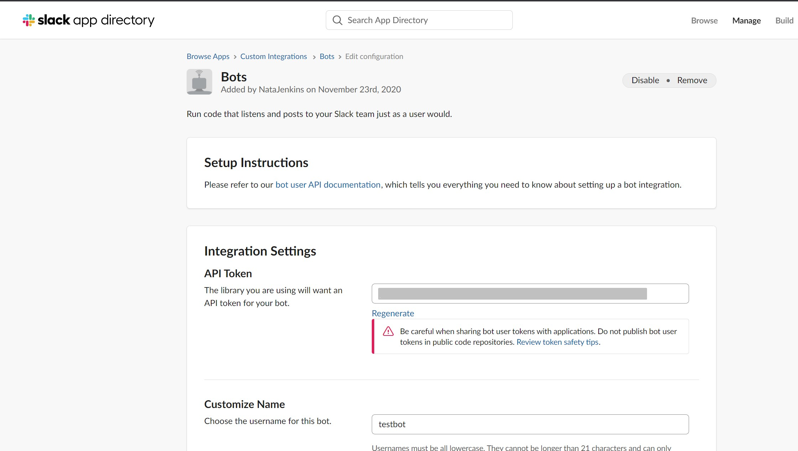

# Project Name

Ruby Capstone: Slack bot

Additional description about the project and its features.

## Built With

- Ruby
- Visual Code Studio

### Prerequisites
- Create a Slack workspace

- Create a new Slack APP in: [Slack create app](https://api.slack.com/apps?new_app=1)
  
- Make sure to Save your Api Token
  

### Setup
- Clone or downoad this repository
### Install
- Go to the root folder of the project
- Run bundle install
- Create a .env file with your Slack Api token.
  - SLACK_API_TOKEN = your API Key
  - 
### Usage
- Go to the root folder
- Run foreman start
- Go to your slack channel and talk to the bot
- Commands:
  - Hello (Bot says Hi)
  - Bye (Bot says Bye)
  - daily-img (Bot gives the photo of the day form national geographic)

### Run tests
- Go to the project root folder
- Run rspec

### Deployment

## Authors

👤 **Author1**

- Github: [@NataJenkins](https://github.com/NataJenkins)
- Twitter: [@NataJenkins](https://twitter.com/NataJenkins)
- Linkedin: [linkedin Profile](https://www.linkedin.com/in/natalia-macias-a11a20187/)

## 🤝 Contributing

Contributions, issues, and feature requests are welcome!

Feel free to check the [issues page](issues/).

## Show your support

Give a ⭐️ if you like this project!

## Acknowledgments

- Hat tip to anyone whose code was used
- Inspiration
- etc

## 📝 License

This project is [MIT](lic.url) licensed.
